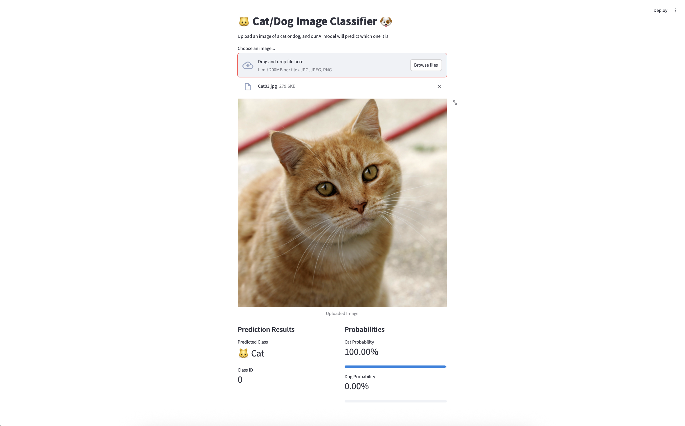

# Cat/Dog Image Classification API and Web Interface

This project provides a complete solution for cat/dog image classification, consisting of a FastAPI backend service and a Streamlit web interface. The system uses a machine learning model to classify images as either cats or dogs with probability scores. The model reused ResNet18 architecture to train and achieve accuracy > 90% .

## Project Structure

```
root/
│
├── app.py              # FastAPI application initialization
├── server.py           # Uvicorn server configuration
├── ui.py              # Streamlit web interface
├── requirements.txt    # Python package dependencies
│
├── config/            # Model hyperparameters and configuration
├── logs/              # API logging information
├── middleware/        # API middleware (CORS, logging, etc.)
├── models/            # Model weights and inference code
├── routes/            # API endpoints and routers
├── schemas/           # Pydantic data models
├── utils/             # Utility functions
└── images/            # Demo and test images
```

## Features

- FastAPI backend service for image classification
- Streamlit web interface for easy interaction
- Real-time image classification with probability scores
- RESTful API endpoints
- CORS support for cross-origin requests
- Logging middleware for request tracking
- Support for common image formats (JPG, JPEG, PNG)

## Prerequisites

- Python 3.8 or higher
- pip (Python package manager)

## Installation

1. Clone the repository:
```bash
git clone <repository-url>
cd deployment_layout
```

2. Create a virtual environment (recommended):
```bash
python -m venv venv
source venv/bin/activate  # On Windows: venv\Scripts\activate
```

3. Install dependencies:
```bash
pip install -r requirements.txt
```

## Running the Application

The application consists of two components that need to be run separately:

### 1. Backend API Server

Start the FastAPI backend server:
```bash
python server.py
```
The API server will run on http://localhost:8080

### 2. Web Interface

In a new terminal window, start the Streamlit interface:
```bash
streamlit run ui.py
```
The web interface will be available at http://localhost:8501

## Usage

1. Open your web browser and navigate to http://localhost:8501
2. Upload an image of a cat or dog using the file uploader
3. The system will process the image and display:
   - The predicted class (Cat or Dog)
   - Probability scores for both classes
   - Visual progress bars for the probabilities

## API Endpoints

- `GET /`: Health check endpoint
- `POST /catdog_classification/predict`: Image classification endpoint
  - Accepts multipart form data with an image file
  - Returns prediction results and probabilities

## Demo

Here's a demo of the application in action:



The demo image shows the web interface where:
1. A user has uploaded an image
2. The system has processed it and displayed:
   - The predicted class (Cat/Dog)
   - Probability scores for both classes
   - Visual progress bars showing the confidence levels
3. The interface provides a clean, user-friendly way to interact with the classification model

You can test the application yourself using this demo image or any other cat/dog image.

## Notes

- Make sure both the backend server and web interface are running simultaneously
- The backend server must be running on port 8080 for the web interface to work properly
- Supported image formats: JPG, JPEG, PNG
- For best results, use clear images of cats or dogs
```
root/
│
├── app.py
├── server.py
├── requirements.txt
│
├── config/
│
├── logs/
│
├── middleware/
│
├── models/
│
├── routes/
│
├── schemas/
│
└── utils/
```
- config: hyper-parameters configuration of models

- logs: logging information when running API

- middleware: middleware of API contains available middleware and custom middleware

- models: contain weights of model, model, inferenced model

- routes: contains API Endpoints(APIRouter), and base Router to include all of child routes

- schemas: contains Pydantic Model

- utils: code use for anywhere

- app.py: code of FastAPI Initialization

- requirements.txt: packages version 

- server.py: code of hosting API(running uvicorn)

